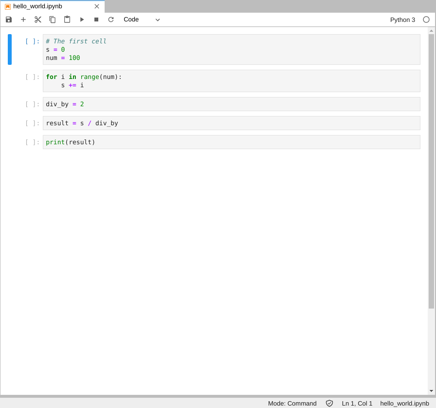
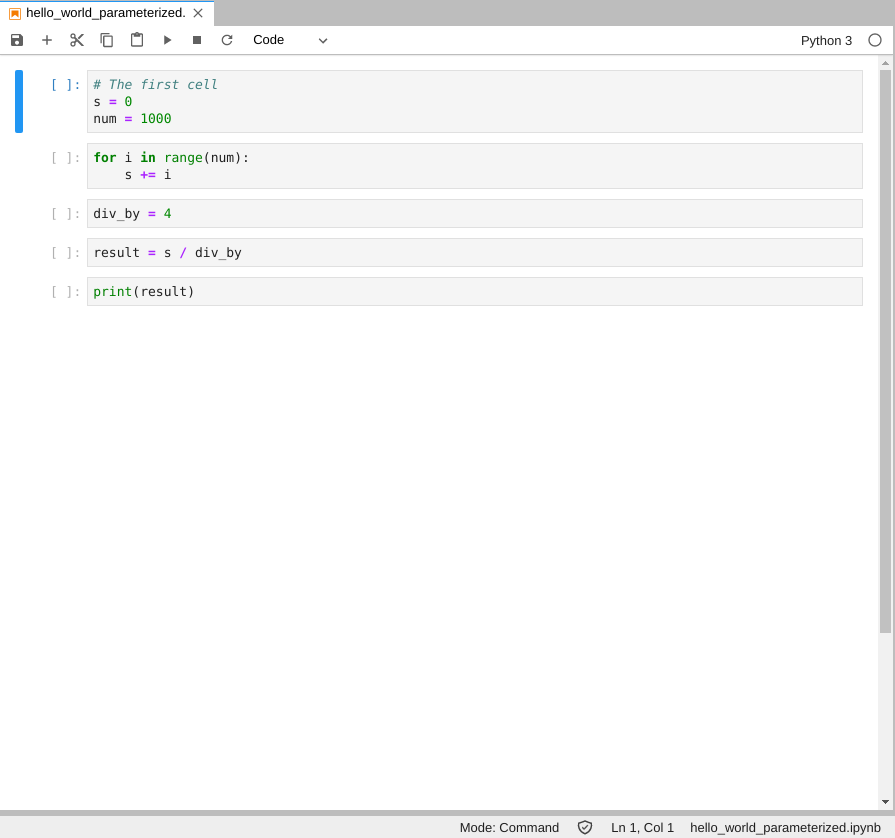

======================
notebook_parameterizer
======================

.. image:: https://travis-ci.org/rasmunk/notebook_parameterizer.svg?branch=master
    :target: https://travis-ci.org/rasmunk/notebook_parameterizer
.. image:: https://badge.fury.io/py/notebook-parameterizer.svg
    :target: https://badge.fury.io/py/notebook-parameterizer

A tool to generate parameterized Jupyter Notebooks. This tool is similar to that of Papermill, but acts as a compliment
to parameterize a Notebook not based on a preset cell that contains the parameters, but allows for parameterization
throughout a Notebook without having to specify so.

Instead the `notebook_parameterizer` uses a parameters YAML file to define which variables should be set to what value.
With these preset variables in the parameters file, the ``notebook_parameterizer`` searches every cell for variable assignments 
that match the given key in the parameters file.

-----
Usage
-----

An example of how to use the `notebook_parameterizer` can be seen below::

    $ notebook_parameterizer -h
    Usage: notebook_parameterizer [OPTIONS] NOTEBOOK_PATH PARAMETERS_PATH

    Options:
    -o, --output_notebook_path TEXT
                                    Path to the parameterized output notebook
    -e, --expand_env_values         Should ENV_ prefixed parameter values be
                                    expanded to their matching OS environment
                                    variable value

    -h, --help                      Show this message and exit.

The NOTEBOOK_PATH is the path to the Notebook that should be parameterized.

The PARAMETERS_PATH is the path to the YAML file that contains the variables that should be parameterized.

For instance, given the following Notebook in ``example/notebooks/hello_world.ipynb``.

We can paramterize the Notebook with the ``example/parameters/hello_world.yml`` parameters file::

    num: 1000
    div_by: 4

This is achived by executing the following command::

    $ notebook_parameterizer example/notebooks/hello_world.ipynb \
     example/parameters/hello_world.yml \
     -o new_hello_world.ipynb

After applying the ``notebook_parameterizer``, the generated ``new_hello_world.ipynb`` Notebook has the following content.

